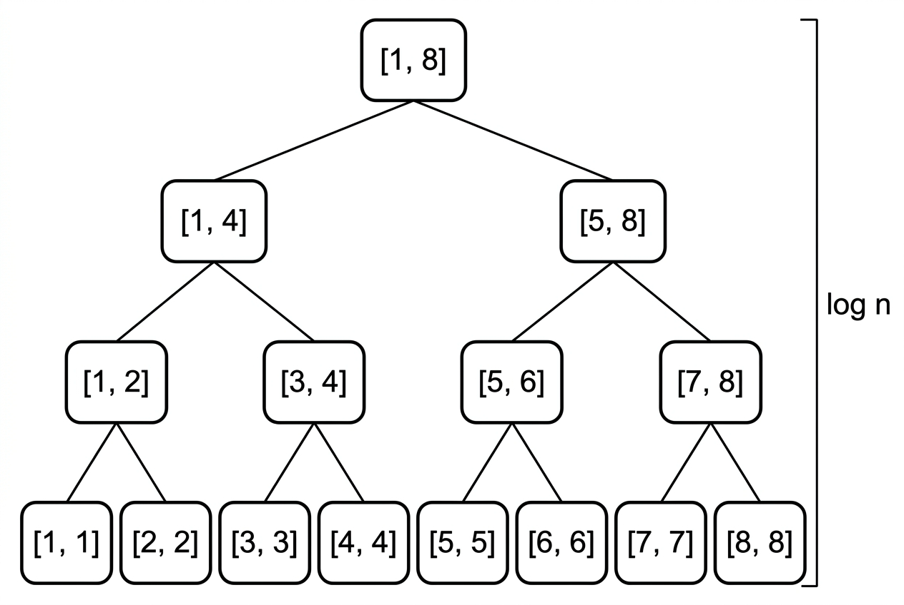

# 課堂筆記：合併排序的總結與逆序對計數 (Inversion Count)

在本次課程中，我們深入探討了**合併排序 (Merge Sort)** 的分治法思想，並延伸應用於解決**逆序對計數 (Inversion Count)** 的經典演算法問題。

---

## 一、 合併排序 (Merge Sort) 總結

合併排序是基於 **分治法 (Divide and Conquer)** 的經典排序演算法。

### 0. 前提引導：如何合併兩個已排序的陣列？
在探討完整排序演算法之前，我們可以先思考一個最核心的子問題：
> **「如果我們有兩個已經排序好的陣列，該如何將它們合併成一個新的、且依然有序的陣列？」**

這個操作被稱為 **Merge (合併)**。我們可以使用 **雙指針 (Two Pointers)** 技術來高效達成：
1. 準備兩個指針，分別指向這兩個已排序陣列的開頭。
2. 比較兩個指針所指向的元素，將較小者放入輔助暫存陣列，並將該指針向後移動一格。
3. 重複此步驟，直到其中一個陣列的所有元素都已被取完。
4. 將另一個陣列剩餘的所有元素直接複製到暫存陣列的末端。

#### 💡 雙指針合併模擬範例
假設我們要合併兩個已排序的子陣列：
* 陣列 $A = [1, 4, 5]$（使用指針 $i$）
* 陣列 $B = [2, 3, 6]$（使用指針 $j$）
* 暫存陣列 $T$（儲存合併後的結果）

| 步驟         | 指針位置                           | 比較與操作                                        | 暫存陣列 $T$ 狀態              |
| :--------- | :----------------------------- | :------------------------------------------- | :----------------------- |
| **Step 1** | $i \to A[0]=1$, $j \to B[0]=2$ | $1 < 2$，取 $A[0]$ 放入 $T$，指針 $i$ 後移            | $T = [1]$                |
| **Step 2** | $i \to A[1]=4$, $j \to B[0]=2$ | $4 > 2$，取 $B[0]$ 放入 $T$，指針 $j$ 後移            | $T = [1, 2]$             |
| **Step 3** | $i \to A[1]=4$, $j \to B[1]=3$ | $4 > 3$，取 $B[1]$ 放入 $T$，指針 $j$ 後移            | $T = [1, 2, 3]$          |
| **Step 4** | $i \to A[1]=4$, $j \to B[2]=6$ | $4 < 6$，取 $A[1]$ 放入 $T$，指針 $i$ 後移            | $T = [1, 2, 3, 4]$       |
| **Step 5** | $i \to A[2]=5$, $j \to B[2]=6$ | $5 < 6$，取 $A[2]$ 放入 $T$，指針 $i$ 後移（陣列 $A$ 用盡） | $T = [1, 2, 3, 4, 5]$    |
| **收尾**     | $j \to B[2]=6$                 | 陣列 $A$ 已空，直接複製 $B$ 剩餘的 $[6]$ 到 $T$ 的末尾       | $T = [1, 2, 3, 4, 5, 6]$ |

由於每個元素僅會被掃描與複製一次，因此這個合併操作的時間複雜度是線性的 $\mathcal{O}(N)$（$N$ 為兩陣列的長度總和）。

**合併排序的核心，就是基於這個前提**：如果我們能不斷將無序陣列對半切割，直到子區間的長度為 1（長度為 1 的子區間天然有序），那麼我們就可以用上述的 $\mathcal{O}(N)$ 方法將它們一層層合併起來，最終完成整個陣列的排序。

### 1. 核心步驟
1. **分割 (Divide)**：將當前區間 $[L, R]$ 從中間 $M = L + \frac{R-L}{2}$ 切分為左右兩個子區間。
2. **解決 (Conquer)**：遞迴地對左右兩個子區間進行合併排序。
3. **合併 (Merge)**：將兩個已排序的子區間合併成一個有序的區間。

### 2. 複雜度分析
* **時間複雜度**：不論在最壞、最好或平均情況下，時間複雜度均為 $\mathcal{O}(N \log N)$。這是因為遞迴樹的深度為 $\mathcal{O}(\log N)$，而每一層合併的總工作量為 $\mathcal{O}(N)$。
* **空間複雜度**：由於合併過程中需要一個輔助陣列來暫存合併結果，因此空間複雜度為 $\mathcal{O}(N)$。
* **穩定性**：合併排序是一種**穩定排序 (Stable Sort)**，在合併時，若左右元素相等，優先選擇左側元素即可維持原有的相對順序。




---

## 二、 逆序對計數 (Inversion Count)

### 1. 什麼是逆序對？
在一個陣列 $A$ 中，若存在兩個索引 $i < j$ 且滿足 $A[i] > A[j]$，則稱 $(A[i], A[j])$ 為一個**逆序對 (Inversion Pair)**。
逆序對的數量反映了陣列的「無序程度」。例如：
* 完全升序陣列的逆序對數量為 $0$。
* 完全降序陣列的逆序對數量為 $\frac{N(N-1)}{2}$。

### 2. 演算法思維：從暴力到分治
* **暴力法**：使用雙重迴圈檢查所有數對，時間複雜度為 $\mathcal{O}(N^2)$，效率較低。
* **分治法 (Merge Sort 延伸)**：
  在合併兩個已排序的子陣列（左區間和右區間）時，我們可以順便計算逆序對的數量。
  
  假設左區間為 $L = [i, mid]$，右區間為 $R = [j, right]$：
  * 當我們發現 $A[i] > A[j]$ 時，因為左區間已是升序排列，這意味著從 $A[i]$ 開始一直到 $A[mid]$ 的所有元素，都必定大於 $A[j]$。
  * 因此，與 $A[j]$ 構成逆序對的元素數量即為左區間剩餘的元素個數：$\text{mid} - i + 1$。
  * 我們只需要將這個數量累加至總計數中，即可在 $\mathcal{O}(N \log N)$ 的時間內完成計數與排序。

---

## 三、 C++ 完整範例程式碼

以下程式碼展示了如何利用合併排序的框架，在 $\mathcal{O}(N \log N)$ 的時間複雜度與 $\mathcal{O}(N)$ 的空間複雜度下，計算陣列的逆序對數量：

```cpp
#include <iostream>
#include <vector>

using namespace std;

// 全域變數
vector<int> arr;
vector<int> temp;

// 合併兩個已排序的區間並計算逆序對
long long mergeAndCount(int left, int right) {
    int mid = left + (right - left) / 2;
    int i = left;    // 左半邊的起點
    int j = mid + 1; // 右半邊的起點
    long long inv_count = 0;

    // 使用單一 for 迴圈進行合併，邏輯清晰
    for (int k = left; k <= right; k++) {
        if (i > mid) {
            // 左半邊已用盡，直接放入右半邊元素
            temp[k] = arr[j++];
        } else if (j > right) {
            // 右半邊已用盡，直接放入左半邊元素
            temp[k] = arr[i++];
        } else if (arr[i] <= arr[j]) {
            // 左邊小於等於右邊，無逆序對，放入左半邊元素
            temp[k] = arr[i++];
        } else {
            // 左邊大於右邊，此時 arr[i] 到 arr[mid] 皆與 arr[j] 構成逆序對
            temp[k] = arr[j++];
            inv_count += (mid - i + 1); // 累加逆序對數量
        }
    }

    // 將合併後的暫存結果複製回原陣列
    for (int k = left; k <= right; k++) {
        arr[k] = temp[k];
    }

    return inv_count;
}

// 遞迴切割陣列並計算逆序對
long long mergeSortAndCount(int left, int right) {
    long long inv_count = 0;
    if (left < right) {
        int mid = left + (right - left) / 2;

        // 1. 計算左半邊的逆序對
        inv_count += mergeSortAndCount(left, mid);
        // 2. 計算右半邊的逆序對
        inv_count += mergeSortAndCount(mid + 1, right);
        // 3. 計算跨越左右兩半邊的逆序對，並在過程中進行排序
        inv_count += mergeAndCount(left, right);
    }
    return inv_count;
}

int main() {
    // 最佳化輸入輸出效能
    ios_base::sync_with_stdio(false);
    cin.tie(NULL);

    int n;
    cin >> n;
    arr.resize(n);
    for (int i = 0; i < n; i++) {
        cin >> arr[i];
    }

    temp.resize(n); // 輔助暫存陣列
    long long inversions = mergeSortAndCount(0, n - 1);

    // 輸出排序後的陣列
    cout << "Sorted array:";
    for (int i = 0; i < n; i++) {
        cout << " " << arr[i];
    }
    cout << "\n";

    // 輸出逆序對數量
    cout << "Number of inversions: " << inversions << "\n";

    return 0;
}
```

---

## 四、 關鍵思考與筆記

> [!TIP]
> 1. **資料型態選擇**：逆序對的最大可能數量為 $\frac{N(N-1)}{2}$。當 $N = 2 \times 10^5$ 時，最大逆序對數接近 $2 \times 10^{10}$，已超出 32 位元整數 (`int`) 的表示範圍。因此，計數變數 `inv_count` 必須宣告為 `long long` 避免溢位。
> 2. **雙指針的巧妙應用**：在合併階段，我們只在右側指標指向的元素被塞入 `temp` 時計算逆序對。這是因為此時右側元素小於左側剩餘的所有元素。

---

## 五、 穩定排序 (Stable Sort) 與 `std::stable_sort`

### 1. 什麼是穩定排序？
若陣列中存在兩個鍵值相同的元素 $A[i]$ 與 $A[j]$，且在排序前 $A[i]$ 排在 $A[j]$ 之前。在排序完成後，**若 $A[i]$ 依然排在 $A[j]$ 之前**，則該排序演算法被稱為**穩定排序 (Stable Sort)**。

| 排序算法 | 是否穩定 | 平均時間複雜度 | 額外空間複雜度 |
| :--- | :--- | :--- | :--- |
| **合併排序 (Merge Sort)** | 是 | $\mathcal{O}(N \log N)$ | $\mathcal{O}(N)$ |
| **插入排序 (Insertion Sort)** | 是 | $\mathcal{O}(N^2)$ | $\mathcal{O}(1)$ |
| **泡沫排序 (Bubble Sort)** | 是 | $\mathcal{O}(N^2)$ | $\mathcal{O}(1)$ |
| **快速排序 (Quick Sort)** | 否 | $\mathcal{O}(N \log N)$ | $\mathcal{O}(\log N)$ |
| **堆積排序 (Heap Sort)** | 否 | $\mathcal{O}(N \log N)$ | $\mathcal{O}(1)$ |
| **選擇排序 (Selection Sort)** | 否 | $\mathcal{O}(N^2)$ | $\mathcal{O}(1)$ |

### 2. C++ 中的選擇
* `std::sort`：預設是不穩定排序（底層多使用內省排序 Introsort，結合了快速排序、堆積排序與插入排序）。
* `std::stable_sort`：C++ 標準庫提供的穩定排序。
  * **底層實現**：通常是合併排序 (Merge Sort)。
  * **複雜度**：若系統記憶體充足，時間複雜度為 $\mathcal{O}(N \log N)$；若記憶體不足，則會退化為 $\mathcal{O}(N \log^2 N)$。
  * **使用場景**：當需要依照「多個鍵值」依序進行排序時（例如：先依學號排序，再依成績排序，且要保留原本學號排序的相對順序）。

---

## 六、 自訂比較函式 (Customized Comparator) 與 `std::sort`

在 C++ 中，我們常用 `std::sort(begin, end, cmp)` 或 `std::stable_sort(begin, end, cmp)` 來實作自訂排序規則。

> [!IMPORTANT]
> **嚴格弱序 (Strict Weak Ordering) 規範**：
> 自訂比較函式 `cmp(a, b)` 必須在 `a` 應該排在 `b` 前面時回傳 `true`，其他情況（包括 `a == b`）回傳 `false`。
> * **切記不要在比較時使用 `<=` 或 `>=`**。如果對相同元素回傳 `true`（例如 `a <= b`），`std::sort` 在某些邊界情況下會發生指標越界，導致程式當掉（Segmentation Fault）。

### 自訂比較函式的四種實作方式

#### 方法 1：結構/類別內重載小於運算子 `operator<` (最常用)
當自訂結構需要有預設排序規則時非常方便。

```cpp
struct Student {
    string name;
    int score;
    int age;

    // 依分數從高到低排序，分數相同時依年齡從低到高排序
    bool operator<(const Student& other) const {
        if (score != other.score) {
            return score > other.score; // 分數高者在前
        }
        return age < other.age; // 年齡小者在前
    }
};

// 使用方式：
vector<Student> students;
std::sort(students.begin(), students.end());
```

#### 方法 2：一般比較函式 (Normal Function)
適用於不修改結構內部，或者需要多種不同排序規則時。

```cpp
bool cmp(int a, int b) {
    return a > b; // 從大到小排序
}

// 使用方式：
vector<int> arr = {3, 1, 4, 1, 5, 9};
std::sort(arr.begin(), arr.end(), cmp);
```

#### 方法 3：Lambda 匿名函式 (推薦，代碼最精簡)
C++11 起支援，適合一次性、局部使用的排序規則。

```cpp
std::sort(students.begin(), students.end(), [](const Student& a, const Student& b) {
    if (a.score != b.score) {
        return a.score > b.score;
    }
    return a.age < b.age;
});
```

#### 方法 4：仿函式 / 比較結構 (Functor)
透過重載 `operator()` 的結構體，常用於 STL 容器（如 `std::map`, `std::set` 或 `std::priority_queue`）的自訂排序。

```cpp
struct StudentComparator {
    bool operator()(const Student& a, const Student& b) const {
        if (a.score != b.score) {
            return a.score > b.score;
        }
        return a.age < b.age;
    }
};

// 使用方式：
std::sort(students.begin(), students.end(), StudentComparator());
```

---

## 七、 練習題

* [a233: 排序法~~~ 挑戰極限](https://zerojudge.tw/ShowProblem?problemid=a233)
* [e579: 10050 - Hartals](https://zerojudge.tw/ShowProblem?problemid=e579)
